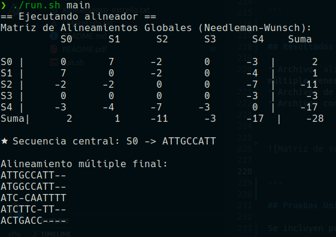
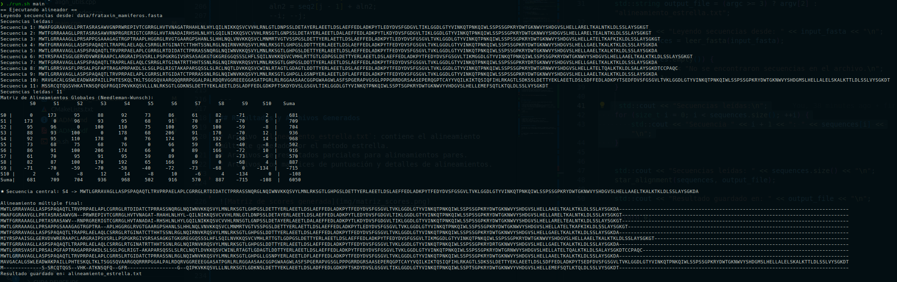
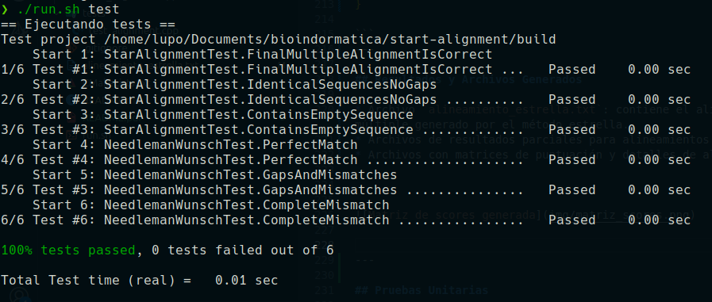

# Proyecto de Alineamiento Múltiple de Secuencias y Alineamiento Estrella

## Descripción del Proyecto

Este proyecto implementa en C++ métodos para el análisis y alineamiento de secuencias biológicas utilizando:

- **Alineamientos múltiples de secuencias**, permitiendo encontrar alineamientos óptimos entre más de dos secuencias.
- **Alineamiento estrella (Star Alignment)**, que utiliza un enfoque centralizado para construir un alineamiento múltiple basado en un alineamiento central (estrella).

El proyecto emplea algoritmos clásicos de programación dinámica, como Needleman-Wunsch para alineamientos globales entre pares, y extiende estas ideas para manejar múltiples secuencias.

Los resultados se generan en archivos de texto para facilitar su análisis y visualización.

---

## Estructura del Proyecto

```

.
├── CMakeLists.txt
├── data
│   └── frataxin_mamiferos.fasta
├── img
├── include
│   ├── align_utils.hpp
│   ├── fasta_reader.hpp
│   ├── needleman_wunsch.hpp
│   ├── score_matrix.hpp
│   └── star_alignment.hpp
├── README.md
├── run.sh
├── src
│   ├── align_utils.cpp
│   ├── fasta_reader.cpp
│   ├── main.cpp
│   ├── needleman_wunsch.cpp
│   ├── score_matrix.cpp
│   └── star_alignment.cpp
└── tests
    └── test_alignment.cpp

````

---

## Compilación y Ejecución

El proyecto utiliza CMake para la compilación y un script `run.sh` que facilita las tareas comunes:

### Otorgar permisos al script (solo la primera vez):

```bash
chmod +x run.sh
````

### Comandos disponibles en el script

```bash
./run.sh build    # Construye el proyecto con CMake y Make
./run.sh test     # Ejecuta las pruebas unitarias
./run.sh main     # Ejecuta el programa principal (alineamiento múltiple y estrella)
```

El script crea un directorio `build/`, genera los archivos de construcción con CMake y compila usando todos los núcleos disponibles.


---

## Funcionalidades Principales

### 1. Alineamientos Múltiples de Secuencias

Permite alinear simultáneamente varias secuencias biológicas utilizando algoritmos de programación dinámica extendidos para múltiples secuencias.

* Entrada: varias secuencias en formato FASTA.
* Salida: alineamientos múltiples óptimos con gaps y coincidencias.
* El resultado se guarda en archivos de texto para análisis posterior.


**Función principal:**

```cpp
int main(int argc, char* argv[]) {
   

    std::string input_fasta = "data/frataxin_mamiferos.fasta";

    std::string output_file = (argc >= 3) ? argv[2] : "alineamiento_estrella.txt";

    std::cout << "Leyendo secuencias desde: " << input_fasta << "\n";
    auto sequences = leer_fasta(input_fasta);

    if (sequences.empty()) {
        std::cerr << "No se encontraron secuencias en el archivo.\n";
        return 1;
    }


    std::cout << "Secuencias leídas: " << sequences.size() << "\n";
    star_alignment(sequences, output_file);

    std::cout << "Resultado guardado en: " << output_file << "\n";

    return 0;
}
```
---

### 2. Alineamiento Estrella (Star Alignment)

Construye un alineamiento múltiple tomando una secuencia central (estrella) y alineando las demás secuencias con ella.

* Se basa en alineamientos pares Needleman-Wunsch entre la secuencia central y cada otra.
* Combina estos alineamientos en una matriz global que representa el alineamiento múltiple.
* Ventaja: reduce la complejidad computacional en comparación con alineamientos múltiples directos.


**Función principal:**

```cpp
std::vector<std::string> star_alignment(const std::vector<std::string>& sequences, const std::string& output_file) {
    
    auto [score_matrix, sum_row] = build_score_matrix(sequences);
    int center_index = print_score_table(sequences, score_matrix, sum_row);
    auto center_seq = sequences[center_index];

    auto pairwise_aligns = align_with_center(center_seq, sequences, center_index);

    std::vector<std::string> multiple;
    multiple.push_back(pairwise_aligns[center_index].first); // Secuencia central con gaps

    for (int i = 0; i < (int)sequences.size(); ++i) {
        if (i == center_index) continue;
        multiple.push_back(pairwise_aligns[i].second); // Secuencias alineadas con gaps
    }

    // Igualar longitud de todas las secuencias agregando gaps al final
    size_t max_len = 0;
    for (const auto& s : multiple) {
        if (s.size() > max_len) max_len = s.size();
    }

    for (auto& s : multiple) {
        if (s.size() < max_len) {
            s += std::string(max_len - s.size(), '-');
        }
    }

    std::cout << "Alineamiento múltiple final:\n";
    for (const auto& s : multiple) std::cout << s << "\n";

    write_to_file(output_file, score_matrix, sum_row, pairwise_aligns, multiple);

    return multiple;
}
```
---

### 3. Algoritmo Needleman-Wunsch para Alineamientos Pares

Base para los alineamientos globales usados en las funcionalidades anteriores.

* Implementación clásica de matriz de scores con penalización por gaps.
* Reconstrucción de uno o múltiples alineamientos óptimos.
* Personalización de la matriz de puntuaciones para diferentes tipos de secuencias.


**Función principal:**

```cpp
int needleman_wunsch(const std::string& seq1, const std::string& seq2, std::vector<std::pair<std::string, std::string>>& alignment) {
    size_t m = seq1.size(), n = seq2.size();
    std::vector<std::vector<int>> score(m + 1, std::vector<int>(n + 1, 0));

    for (size_t i = 0; i <= m; ++i) score[i][0] = i * GAP;
    for (size_t j = 0; j <= n; ++j) score[0][j] = j * GAP;

    for (size_t i = 1; i <= m; ++i) {
        for (size_t j = 1; j <= n; ++j) {
            int match = score[i - 1][j - 1] + (seq1[i - 1] == seq2[j - 1] ? MATCH : MISMATCH);
            int del = score[i - 1][j] + GAP;
            int ins = score[i][j - 1] + GAP;
            score[i][j] = std::max({match, del, ins});
        }
    }

    std::string aln1, aln2;
    size_t i = m, j = n;
    while (i > 0 || j > 0) {
        if (i > 0 && score[i][j] == score[i - 1][j] + GAP) {
            aln1 = seq1[i - 1] + aln1;
            aln2 = '-' + aln2;
            --i;
        } else if (j > 0 && score[i][j] == score[i][j - 1] + GAP) {
            aln1 = '-' + aln1;
            aln2 = seq2[j - 1] + aln2;
            --j;
        } else {
            aln1 = seq1[i - 1] + aln1;
            aln2 = seq2[j - 1] + aln2;
            --i; --j;
        }
    }

    alignment.push_back({aln1, aln2});
    return score[m][n];
}

```
---

## Resultados y Archivos Generados

* Archivo `alineamiento_estrella.txt`: contiene el alineamiento múltiple generado por el método estrella.
* Archivos de resultados parciales para alineamientos pares.
* Archivos con matrices de puntuación y detalles de alineamientos.


**Resultado de la prueba 1:**




**Resultado de la prueba 2 con FASTA:**



---

## Pruebas Unitarias

Se incluyen pruebas automáticas usando Google Test que validan:

* Lectura correcta de archivos FASTA.
* Precisión del algoritmo Needleman-Wunsch en alineamientos pares.
* Correcta construcción del alineamiento estrella.
* Funciones utilitarias para manejo de secuencias y cálculo de scores.

Ejecuta las pruebas con:

```bash
./run.sh test
```

**Resultados test:**



---

## Requisitos del Sistema

* Compilador C++ con soporte para C++11 o superior
* CMake 3.10 o superior
* Google Test (para ejecutar pruebas unitarias)
* Sistema Linux, macOS o Windows con entorno compatible


