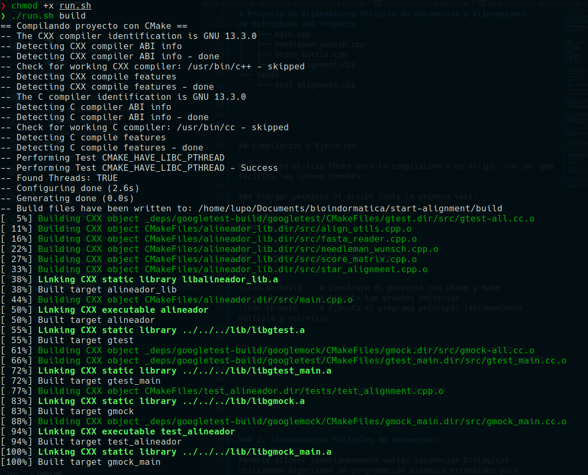

# Alineamiento Global de Secuencias con Needleman-Wunsch

## Descripción del Proyecto

Este proyecto implementa en C++ un sistema para el análisis y alineamiento de secuencias de texto mediante el algoritmo de Needleman-Wunsch. El programa ofrece tres funcionalidades principales:

1. **Detección de subcadenas**: Identifica relaciones de inclusión entre dos cadenas de texto.
2. **Cálculo de puntuación**: Evalúa la similitud entre dos cadenas alineadas mediante un sistema de puntuación.
3. **Alineamiento global óptimo**: Implementa el algoritmo de programación dinámica para encontrar el mejor alineamiento posible entre dos secuencias.

Los resultados se almacenan sistemáticamente en archivos de texto para su posterior análisis.

## Estructura del Proyecto

```
.
├── CMakeLists.txt
├── data
│   └── resultado.txt
├── img
│   ├── compilacion.png
│   ├── ejemplo_alineamiento.png
│   └── matriz_scores.png
├── include
│   ├── AlignmentUtils.hpp
│   ├── IOUtils.hpp
│   └── Menu.hpp
├── README.md
├── run.sh
├── src
│   ├── AlignmentUtils.cpp
│   ├── IOUtils.cpp
│   ├── main.cpp
│   └── Menu.cpp
└── tests
    └── test_alignment.cpp
```

---

## Compilación y Ejecución

El proyecto utiliza CMake como sistema de construcción. Se provee un script `run.sh` para facilitar el proceso:

### Dar permisos de ejecución al script (solo la primera vez):

```bash
chmod +x run.sh
```

### Opciones del script

```bash
./run.sh build    # Compila el proyecto con CMake y Make
./run.sh test     # Ejecuta los tests unitarios
./run.sh main     # Ejecuta el programa principal (alineador global)
```

El script crea una carpeta `build/`, genera los archivos con CMake y compila usando todos los núcleos disponibles.

---



## Funcionalidades principales

### 1. Verificar substring

Determina si una cadena es substring de la otra y devuelve un mensaje explicativo.

**Función principal:**

```cpp
std::string verificarSubstring(const std::string& s1, const std::string& s2) {
    if (s1.find(s2) != string::npos)
        return "\"" + s2 + "\" es substring de \"" + s1 + "\".";
    if (s2.find(s1) != string::npos)
        return "\"" + s1 + "\" es substring de \"" + s2 + "\".";
    return "Ninguna cadena es substring de la otra.";
}
```


---

### 2. Calcular score entre dos cadenas

Calcula el score comparando carácter por carácter:

- **+1** por cada coincidencia de caracteres
- **-1** por cada caracter que no coincida
- **-2** por cada gap

**Función principal:**


```cpp
int calcularScoreCaracter(char a, char b) {
    return (a == b) ? 1 : -1;
}

int calcularScoreAlineado(const std::string& s1, const std::string& s2) {
    // Eliminación de espacios para el cálculo
    std::string clean1, clean2;
    for (char c : s1) if (c != ' ') clean1 += c;
    for (char c : s2) if (c != ' ') clean2 += c;

    if (clean1.size() != clean2.size()) {
        throw std::invalid_argument("Las secuencias deben tener igual longitud");
    }

    int total = 0;
    for (size_t i = 0; i < s1.size(); ++i) {
        total += (s1[i] == '-' || s2[i] == '-') ? -2 : calcularScoreCaracter(s1[i], s2[i]);
    }
    return total;
}
```


---

### 3. Alineamiento global (Needleman-Wunsch)

Implementación del algoritmo completo con:

- Construcción de matriz de scores
- Reconstrucción de alineamientos óptimos
- Visualización de resultados

```cpp
int alineamientoGlobal(const string& s1, const string& s2) {
    const int gap = -2;
    size_t n = s1.size(), m = s2.size();
    vector<vector<int>> matriz(n + 1, vector<int>(m + 1));

    // Inicialización de bordes
    for (size_t i = 0; i <= n; ++i) matriz[i][0] = i * gap;
    for (size_t j = 0; j <= m; ++j) matriz[0][j] = j * gap;

    // Llenado de matriz
    for (size_t i = 1; i <= n; ++i) {
        for (size_t j = 1; j <= m; ++j) {
            matriz[i][j] = max({
                matriz[i - 1][j - 1] + calcularScoreCaracter(s1[i - 1], s2[j - 1]),
                matriz[i - 1][j] + gap,
                matriz[i][j - 1] + gap
            });
        }
    }

    // Reconstrucción y visualización de resultados
    vector<string> alineamientos1, alineamientos2;
    reconstruirAlineamientos(s1, s2, matriz, alineamientos1, alineamientos2);

    guardarResultado("../data/resultado.txt", matriz, alineamientos1, alineamientos2, matriz[n][m]);
    return matriz[n][m];
}
```
---


## Resultados y Salida

El programa genera un archivo `resultado.txt` con:

1. Score final del alineamiento
2. Matriz completa de scores
3. Número de alineamientos óptimos encontrados
4. Secuencias alineadas

Ejemplo de salida:

```
Score final: -3

Matriz de scores:
0	-2	-4	-6	-8	-10	-12	-14	-16	-18	-20	-22	
-2	-1	-1	-3	-5	-7	-9	-11	-13	-15	-17	-19	
-4	-1	-2	0	-2	-4	-6	-8	-10	-12	-14	-16	
-6	-3	-2	-2	1	-1	-3	-5	-7	-9	-11	-13	
-8	-5	-4	-3	-1	2	0	-2	-4	-6	-8	-10	
-10	-7	-6	-5	-3	0	1	-1	-3	-5	-5	-7	
-12	-9	-8	-5	-5	-2	1	0	0	-2	-4	-6	
-14	-11	-8	-7	-6	-4	-1	2	0	-1	-3	-3	

Cantidad de alineamientos óptimos: 2
Alineamiento 1:
-TACCG-A--T
ATACCATACGT

Alineamiento 2:
-TACC-GA--T
ATACCATACGT


```


## Pruebas Unitarias

El proyecto incluye pruebas automatizadas con Google Test para validar:

- Correcta detección de subcadenas
- Cálculo preciso de scores
- Implementación del algoritmo de alineamiento

Ejecución de pruebas:
```bash
./run.sh test
```

## Requisitos del Sistema

- Compilador C++ compatible con C++11
- CMake versión 3.10 o superior
- Google Test (opcional, para ejecución de pruebas)


